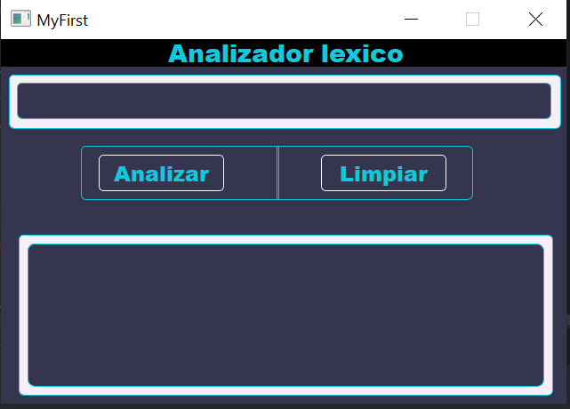

# Analizador Léxico del Lenguaje MyFirst

Este proyecto implementa un analizador léxico para el lenguaje de programación MyFirst. El analizador léxico se encarga de identificar y extraer los tokens del código. El proyecto está desarrollado en Python y utiliza la biblioteca de interfaz gráfica de usuario QTdesigner.

## Tokens del lenguaje MyFirst
El lenguaje MyFirst utiliza los siguientes tokens:

- Números Enteros: Se representan por una secuencia de dígitos sin decimales.
- Números Decimales: Se representan utilizando el símbolo **~** como separador decimal, por ejemplo, 4~9
- Identificadores: Se delimitan con llaves "{}" y pueden contener letras minúsculas o mayúsculas y números. Se limita la longitud a un máximo de 10 caracteres.
- Palabras reservadas: **Entero, Real, Para, Mientras, Private, Public, Paquete, Importar, Clase, Return, Break, Palabra, Python, Tlf, Lexico, Sintactico, Semantico, Error, True.**
- Operadores aritméticos: **¿ (suma), ? (resta), + (multiplicación), - (división).**
- Operadores relacionales: **"==", "!=", "<", ">", "<=", ">=".**
- Operadores lógicos: **"&&", "||", "!".**
- Operadores de asignación: **"=", "+=", "-=", "*=", "/=".**
- Operadores de incremento: **"."** (punto).
- Operadores de decremento: **"¡"** (signo de admiración).
- Paréntesis: **"("** Apertura y **")"** cierre.
- Llaves: **"["** Apertura y **"]** cierre.
- Terminal (Fin de sentencia): **","** (coma).
- Separador: **";"** (punto y coma).
- Hexadecimal: Se representa con el símbolo **"¬"** seguido de dígitos y letras mayúsculas de la A a la F, es importante que esten entro los simbolos,  Por ejemplo, **¬ABC123¬**.
- Cadenas de caracteres: Se delimitan con el símbolo **"%"** al **inicio** y al **final**. Por ejemplo, **%cadena de caracteres%**.
- Comentarios en línea: Comienzan con el símbolo **"#"** y todo lo que sigue hasta el final de la línea se considera un comentario.
- Comentarios en bloque: Comienzan con el símbolo **"°"** y terminan con el símbolo **"°"**. Todo lo que está entre estos símbolos se considera un comentario de bloque.
## Especificaciones del Analizador Léxico
- El analizador léxico está implementado en Python utilizando la biblioteca de interfaz gráfica de usuario QTdesigner.
- El analizador léxico detecta errores como cadenas de caracteres sin cerrar y tokens no reconocidos.

## Screenshots

